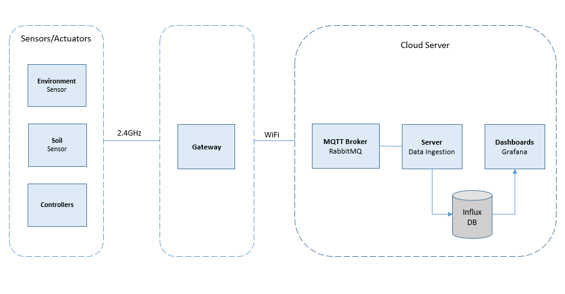

# Senseed
 
Senseed, a Smart Agriculture IoT System, is an end-to-end IoT solution designed to monitor and manage agricultural environments. This repository includes the **firmware**, **hardware**, **enclosures**, and **server setup** required to deploy the system. 
 
 

  

 
 

## System Overview
This system leverages a wireless sensor network in a star topology, using **NRF24L01** modules operating at 2.4GHz for communication. The network comprises soil and environmental sensors that gather data and transmit it to a central gateway. The gateway serves as the primary hub, collecting sensor data and communicating with the controllers to make real-time adjustments.  
 
For data processing and storage, the gateway connects to an Ubuntu server over **WiFi**, using the **MQTT** protocol with **RabbitMQ** as the message broker. On the server side, **InfluxDB** is used for time-series data storage.  

 
 

  

 
 

The gateway is powered by an **ATMEGA1284** and connects to the internet via an **ESP32** module, utilizing AT commands. The sensors and controllers in the system are based on the **ATMEGA328P** microcontroller.  
 
The environmental sensor is optimized for low-power operation, measuring temperature and humidity with a high-precision SHT40 sensor while also monitoring battery voltage to ensure reliable performance over extended periods.  
 
The soil sensor assesses soil moisture levels using a moisture probe.  
 
The controllers are designed for both low and high-power applications, managing devices through relay control. Each controller is equipped with a battery-powered real-time clock (RTC) to maintain accurate time in case of power outages. The high-power controller additionally monitors current consumption using an ACS712 sensor for enhanced energy management.

 
 

**NOTE: This project is intended as a demonstration of architecture and coding practices. It is not a complete, production-ready system, but rather a proof-of-concept illustrating key components of an IoT-based smart agriculture solution.**

